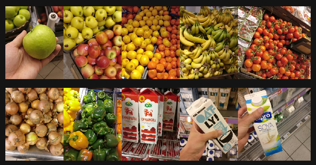

# IPCV Course Project - Product Classification


Collaboration: Hesam Sheikh Hassani, Habib Kazemi, Safoura Banihashemi

models:
```
----------------------------------------------------------------
        Layer (type)               Output Shape         Param #
================================================================
            Conv2d-1         [-1, 16, 128, 128]             448
         MaxPool2d-2           [-1, 16, 64, 64]               0
            Conv2d-3           [-1, 32, 64, 64]           4,640
         MaxPool2d-4           [-1, 32, 32, 32]               0
            Conv2d-5           [-1, 64, 32, 32]          18,496
         MaxPool2d-6           [-1, 64, 16, 16]               0
            Conv2d-7           [-1, 96, 16, 16]          55,392
         MaxPool2d-8             [-1, 96, 8, 8]               0
            Conv2d-9            [-1, 128, 8, 8]         110,720
        MaxPool2d-10            [-1, 128, 4, 4]               0
           Conv2d-11            [-1, 128, 4, 4]         147,584
        MaxPool2d-12            [-1, 128, 2, 2]               0
          Flatten-13                  [-1, 512]               0
           Linear-14                  [-1, 128]          65,664
          Dropout-15                  [-1, 128]               0
           Linear-16                   [-1, 64]           8,256
          Dropout-17                   [-1, 64]               0
           Linear-18                   [-1, 43]           2,795
================================================================
Total params: 413,995
Best Val ACC: 45%
```

```
----------------------------------------------------------------
        Layer (type)               Output Shape         Param #
================================================================
            Conv2d-1         [-1, 16, 256, 256]             448
         MaxPool2d-2         [-1, 16, 128, 128]               0
            Conv2d-3         [-1, 32, 128, 128]           4,640
         MaxPool2d-4           [-1, 32, 64, 64]               0
            Conv2d-5           [-1, 64, 64, 64]          18,496
         MaxPool2d-6           [-1, 64, 32, 32]               0
            Conv2d-7           [-1, 96, 32, 32]          55,392
         MaxPool2d-8           [-1, 96, 16, 16]               0
            Conv2d-9          [-1, 128, 16, 16]         110,720
        MaxPool2d-10            [-1, 128, 8, 8]               0
           Conv2d-11            [-1, 128, 8, 8]         147,584
        MaxPool2d-12            [-1, 128, 4, 4]               0
          Flatten-13                 [-1, 2048]               0
           Linear-14                  [-1, 256]         524,544
          Dropout-15                  [-1, 256]               0
           Linear-16                   [-1, 64]          16,448
          Dropout-17                   [-1, 64]               0
           Linear-18                   [-1, 43]           2,795
================================================================
Total params: 881,067
Trainable params: 881,067
Non-trainable params: 0
----------------------------------------------------------------
Input size (MB): 0.75
Forward/backward pass size (MB): 18.85
Params size (MB): 3.36
Estimated Total Size (MB): 22.96
----------------------------------------------------------------
Best Val Acc: 35%
```

